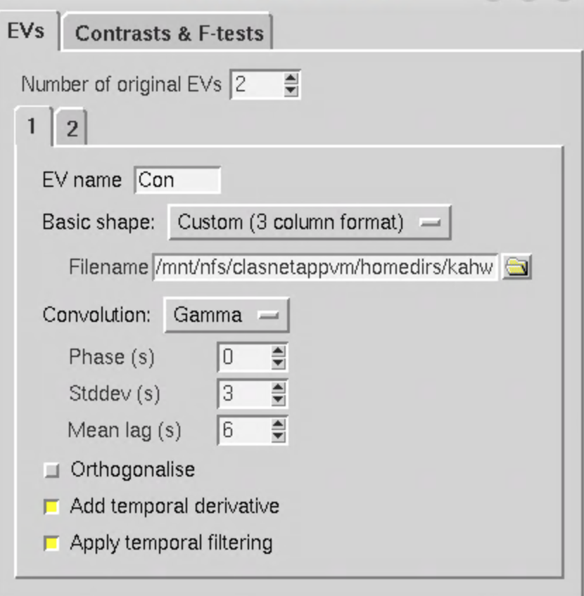
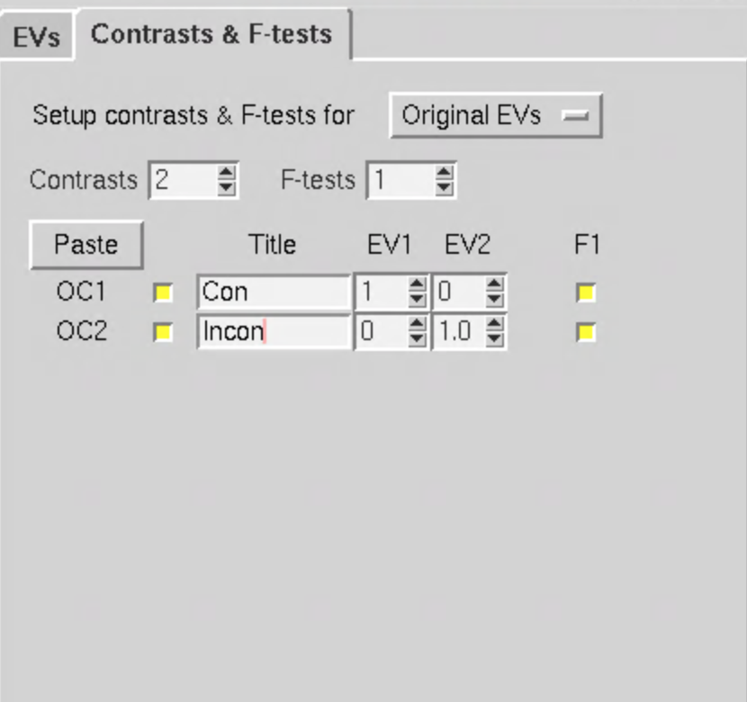
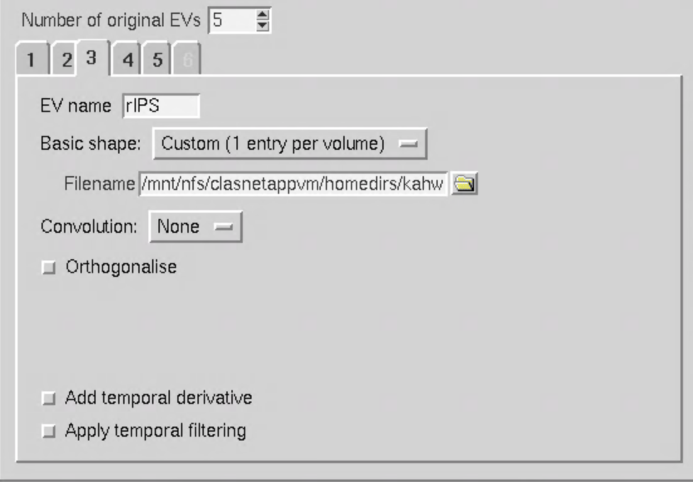
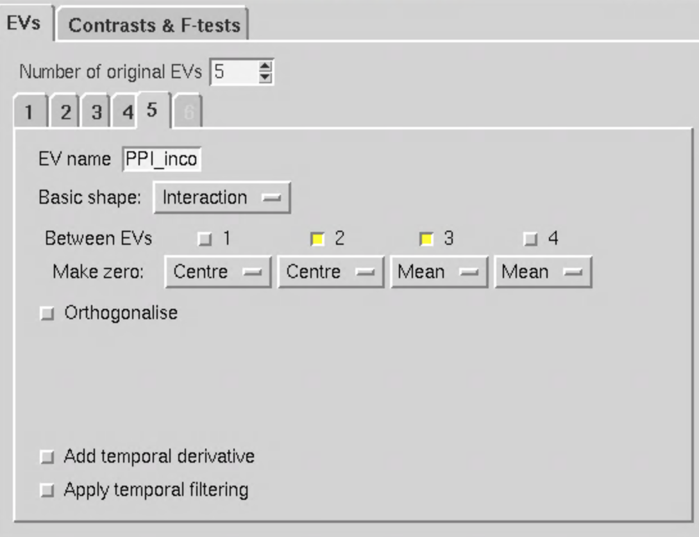
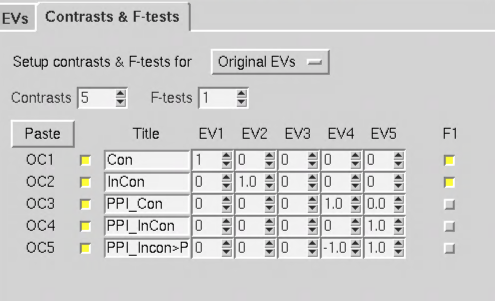

# Hands on Lab session #2, task-related functional connectivity
In the previous lab, we analyzed patterns of functional connectivity from fMRI data collected while subjects were "at rest", aka resting-state functional connectivity. In this lab practice, we will perform analysis for finding out how functional connectivity while subjects are actively engaged in a cognitive task, also known as task functional connectivity, task-related functional connectivity, or task-evoked functional connectivity in the literature. There are many different approaches developed for this purpose, and we will be performing a specific approach called **psychophysiological interaction analysis (PPI)**. This approach determines if the correlation (functional connectivity) between brain regions differ between different task conditions.

You can find out more about this approach here: \
https://fsl.fmrib.ox.ac.uk/fsl/fslwiki/PPI

In this lab, you should learn the following
- What is a "psychophysiological interaction"?
- How to setup PPI regressor in FEAT?
- How to interpret the findings?

## Step 1, process task fMRI data
First we need to preprocess and run GLM on task fMRI data. We will be repeating the steps described in the previous block. For reference see: \
https://github.com/mwvoss/MRI-lab-classes/blob/master/PSY4025-2020-FA2020/practical_preprocessing-fmri-with-feat.md \
https://github.com/mwvoss/MRI-lab-classes/blob/master/PSY4025-2020-FA2020/practical_single-subject-task-analysis.md

We will be using sub-001's task-flanker data.

- Select `First level analysis` and `full analysis`
- Select `sub-001_task-flanker_bold.nii.gz` as the input
- Name your output folder 'flanker_taskFC'
- **Delete 3 Volumes from analysis**
  - Initial outliers are bad fro PPI analysis thus must be removed.
- Setup the preprocessing options under `Pre-stats`
  - MCFLIRT
  - Turn on bet
  - 6mm FWHM smoothing
  - Highpass
- For `Registration`
  - Selected the brain extracted T1 as the main structural image
  - 12 dof and normal search
- For `Stats`
  - Use `FILM`
  - Select `Standard Motion Parameters`
  - Under `Full Model Setup`
    - For simplicity, we will just model the congruent and incongruent trials, plus the outlier (but turn off `Convolution` for outliers)
    
    - Setup the following contrasts
    
- Hit run!

## Step 2. Decide which ROI you want to use as your seed ROI and extract time series from it.
Let us open up results from the feat analysis, and decide which ROI we want to use to examine task functional connectivity with this ROI.
  - Open up `fsleyes`
  - Display both `highres` (under reg/) and `rendered_thresh_zstat.nii.gz`
  - Threshold it to display activation blobs with z > 2.
  - Let us find a peak activation locus that we want to use to plot down our ROI: voxel location (21 19 22), coordinate(8 -10 25)
  - We need to run the following commands in the terminal to create the ROI at this location and extract its timeseires.
   - First, in the terminal, navigate to the FEAT folder: `cd ~/fmrilab/data/bids/sub-001/func/flanker_FC.feat` or wherever you saved your FEAT analysis
   - `fslmaths filtered_func_data.nii.gz -mul 0 -add 1 -roi 21 1 19 1 22 1 0 1 rIPS -odt float`
   - `fslmaths rIPS.nii.gz -kernel sphere 8 -fmean rIPS -odt float`
   - `fslmeants -i filtered_func_data.nii.gz -o rIPS.txt -m rIPS.nii.gz`
   - We will use the resulting rIPS.txt as the input to do our flanker_taskFC

## Step 3. perform PPI with FEAT
We will setup a new feat analysis by inputing the timeseries we extracted.
- Select `First level analysis`, `Statistics`
- Select `input is a FEAT directory`, select the output feat folder from the previous step.
- Under `Stats`, let us setup the `Full model setup`
  - We will add 3 more EVs, remove the outlier EV, so total of 5
  - Ev1 to 2 should be identical to the previous feat you ran. For congruent and incongruent trials.
  - For Ev3, we will input the rIPS timeseries. Select `Custom (1 entry per volume)`. Deslect `temporal derivative` and `temporal filtering`
  
  - For EV4, it will be the "PPI" regressor, where the Congruent condition interacts with the rIPS timeseries. Name it `PPI_con`.
  - Select `interaction` under `Basic Shape`. Select `1` and `3` for `Between EVs`: this indicates that you want to allow the congruent (EV1) to interact with the seed timeseries (Ev3).
  - For make zero, select `Centre` for 1 and `mean` for 3
  
  - For EV5, it will be the PPI regressor for incongruent interacts with the rIPIS timeseries. Name it `PPI_Incon`.
  - Select `interaction` under `Basic Shape`. Select `2` and `3` for `Between EVs`: this indicates that you want to allow the Incongruent (EV2) to interact with the seed timeseries (Ev3).
  - For make zero, select `Centre` for 2 and `mean` for 3
     
  - We will have 5 contrasts. Set it up this way:
  

## Step4 Look at the results.
- In general, PPI analysis lacks power, so not surprising if we don't find much. We will discuss the issues in class.
- If you do find a significant cluster in any of the contrasts, what do they mean?
  - For regions found to be significant for the contrast of gPPI_congruent, what does it mean?
  - For regions found to be significant for the contrast of gPPI_Incongruent, what does it mean?
  - For the contrast of gPPI_Incongruent > gPPI_Congruent, what does it mean?
