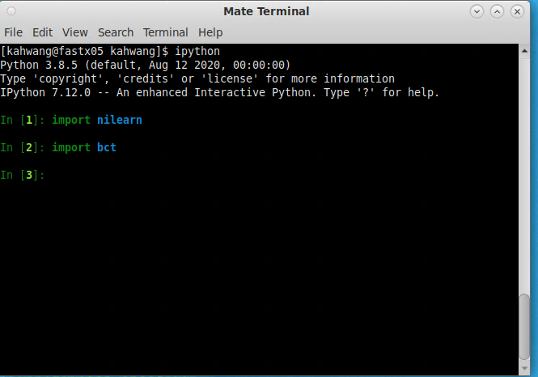
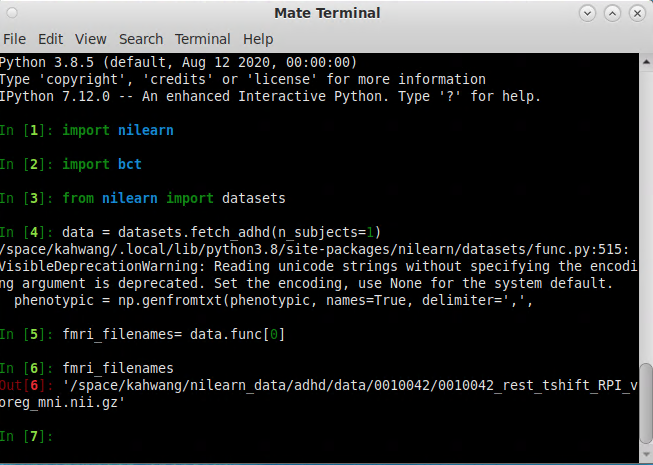
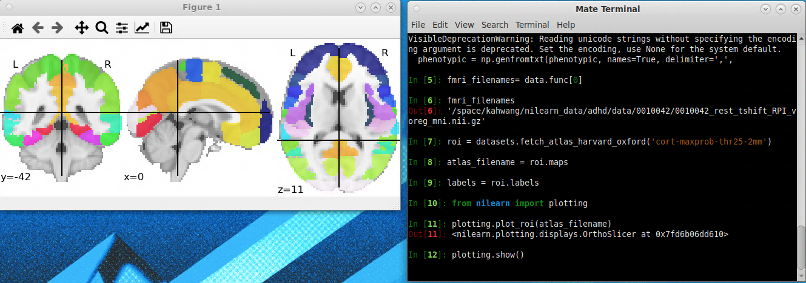
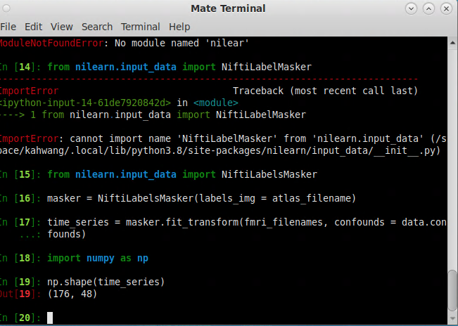
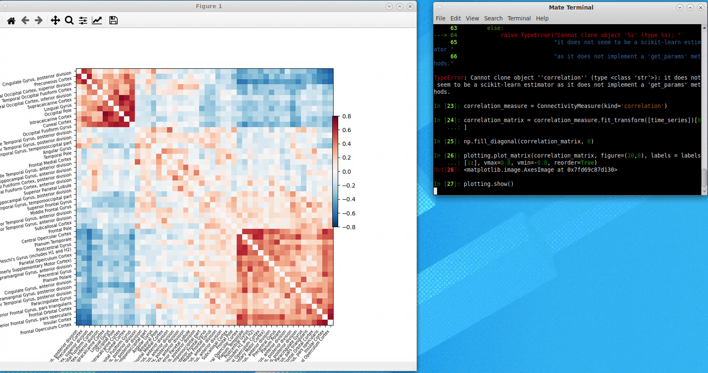
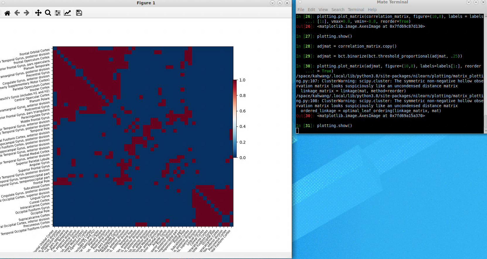
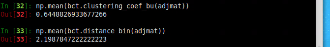

# Hands on Lab session #3, whole-brain, network analysis
In the previous two practices, we practiced on how to conduct "seed-based" functional connectivity for both resting-state and task fMRI data. Seed-based functional connectivity analysis examines the functional connectivity relationship between a single "seed" region and the rest of the brain. Today we will be conducting another type of functional connectivity analysis, examining the functional connectivity **among multiple brain regions**.

In this lab practice session, you will learn:
- How to calculate functional connectivity between multiple ROIs.
- How to interpret the resulting matrix.
- How to use that matrix for graph theory analysis. 

# Step 1. Setup python packages
We will be using the following two python packages developed to perform connectivity and network analysis: \
https://nilearn.github.io/index.html \
https://github.com/aestrivex/bctpy

We first have to make sure these packages are installed in your system:
- Open the terminal and do:
  - `pip3 install --user nilearn`
  - `pip3 install --user bctpy`
- In ther terminal, enter the IPython envrionment:
  - type `ipython`:
  - try to import these two packages into IPython
  - `import nilearn`
  - `import bct`

  

# Step 2. Let us import some datasets from the internet for our analysis.
- Type the following in the ipython terminal
  - `from nilearn import datasets`
  - `data = datasets.fetch_adhd(n_subjects=1)`  
  - `fmri_filenames = data.func[0]`

   \
  This is a resting-state fMRI dataset from one ADHD subject that we just downloaded.

- We will also download a brain parcellation and visualize it. This parcellation contains multiple ROIs that we will use for our connectivity analysis. Do the following in the terminal:
  - `roi = datasets.fetch_atlas_harvard_oxford('cort-maxprob-thr25-2mm')`
  - `atlas_filename = roi.maps`
  - `labels = roi.labels`
  - `from nilearn import plotting`
  - `plotting.plot_roi(atlas_filename)`
  - `plotting.show()`

   \
  This plot shows the ROIs (regions of interests) in the cortex, each labeled with a different color. We can now extract signals from these ROIs, and calculate the functional connectivity between them.
  - remember to close the plotting window to get back to the terminal.

# Step 3, ROI by ROI, pairwise, whole-brain functional connectivity

- We will now extract data from these ROIs. Do the following in the terminal:
  - `from nilearn.input_data import NiftiLabelsMasker`
  - `masker = NiftiLabelsMasker(labels_img=atlas_filename)`
  - `time_series = masker.fit_transform(fmri_filenames, confounds=data.confounds)`\
  The resulting 'time_series' variable contains the timeseries signal from all the ROIs. You can do the following.
  - `import numpy as np`
  - `np.shape(time_series)` \
  the returning results (176,48) indicates that there are 48 ROIs, each has 176 TRs of data.\
   \

- We will now compute the functional connectivity between these 48 ROIs and display it. Do the following in the terminal:
  - `from nilearn.connectome import ConnectivityMeasure`
  - `correlation_measure = ConnectivityMeasure(kind='correlation')`
  - `correlation_matrix = correlation_measure.fit_transform([time_series])[0]`
  - `np.fill_diagonal(correlation_matrix, 0)`
  - `plotting.plot_matrix(correlation_matrix, figure=(10, 8), labels=labels[1:], vmax=0.8, vmin=-0.8, reorder=True)`
  - `plotting.show()`
  
- The returning varialbe 'correlation_matrx' is a matrix where each element indicates the strength of functional connectivity (correlation coefficient) between each ROI. The plot visualizes this matrix, and colorcoded the strength of functional connectivity.
- What other interesting patterns do you notice?

# Step 4, graph theory analysis
- Let us do some graph theory analysis. The first step is to convert the correlation matrix into a binarized adjacency matrix.
  - `adjmat = correlation_matrix.copy() `
  - `adjmat = bct.binarize(bct.threshold_proportional(adjmat, .25)) `
  - `plotting.plot_matrix(adjmat, figure=(10, 8), labels=labels[1:], reorder=True) `
  - `plotting.show()`
  
  As you can see, now each element been converted to either 1 or 0, depending on a threshold.

- Let us calculate the "clustering coefficient" and "path length" of this network to test its "small-world" property.
  - For clustering coefficient, do
  `np.mean(bct.clustering_coef_bu(adjmat)) `
  - For path length, do
  `bct.charpath(bct.distance_bin(adjmat))[0]`
  - What are the results? How do we interpret it? \
  
