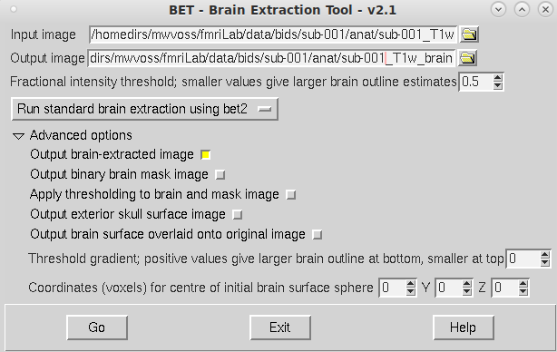

**By the end of this practical you should be able to:**  
* [ ] use FSL's [bet](https://fsl.fmrib.ox.ac.uk/fsl/fslwiki/BET/UserGuide) tool to remove the brain from a T1 image  
* [ ] use FSLeyes to check the output of `bet`   
 

**Access FastX** through the remote login:  
https://fastx.divms.uiowa.edu:3443/   
 

**Download behavioral and reconstructed imaging data**, download the data we provided:  
*  Open your terminal by clicking on the icon showing a little black screen
*  Type `pwd`. Where are you in the computer filesystem?
*  Type `ls`. What other files are here? 
*  Go into the folder you made previously by typing `cd fmriLab`
*  Copy/paste `wget -O flanker-data.tar.gz https://osf.io/gk2cy/download`
*  Use commands introduced previously to see what was downloaded
*  To unpack the download copy/paste `tar -xvf flanker-data.tar.gz`
*  Move yourself into the folder with data by typing `cd data`
   *  You should see two directories named `behData` and `bids`
   *  Navigate to these within your file browser and let's talk about what these are...
 

**Prepare the T1 for functional analysis by stripping away the skull**:  
*  Also known as `brain extraction` or `skull-stripping`
*  In the terminal, move yourself to where your data are
   *  Type `cd bids`
   *  What's here? Type `ls`
*  We will use FSL's `bet` tool (**b**rain **e**xtraction **t**ool) to strip away skull
   *  Type `fsl`
   *  Click this button: 
   *  Below is an example of file input and output with default settings. Set yours up and click `Go`. 

Example bet setup for `sub-001` with default settings:  

 

**Check the results of `bet`**:  
*  Use `fsleyes` to open the T1 image with skull and overlay the skull-stripped image we just made that ends with `_brain.nii.gz`
*  Change the color of the overlay for the skull-stripped image
*  Reduce the opacity of the overlay so you can see brain/non-brain boundaries
*  Let's evaluate together...
   *  Any brain tissue missing?
   *  Anything counted as brain that shouldn't be?

 

**Suggested modified `bet` settings**:  
*  Set `fractional intensity threshold` to .4
*  Use drop-down menu for `bet` pre-baked settings to select `Robust brain centre estimation (iterates bet2 several times)`
*  Click `Go`
*  Check results

 

**Repeat steps with `sub-002`:**  
*  Once you have a skull-stripped image named `sub-001_T1w_brain.nii.gz` that you're happy with, try the same settings on `sub-002` and evaluate.

 

**Before the next lab**, you should have a good skull-stripped T1 image for both subjects. 
