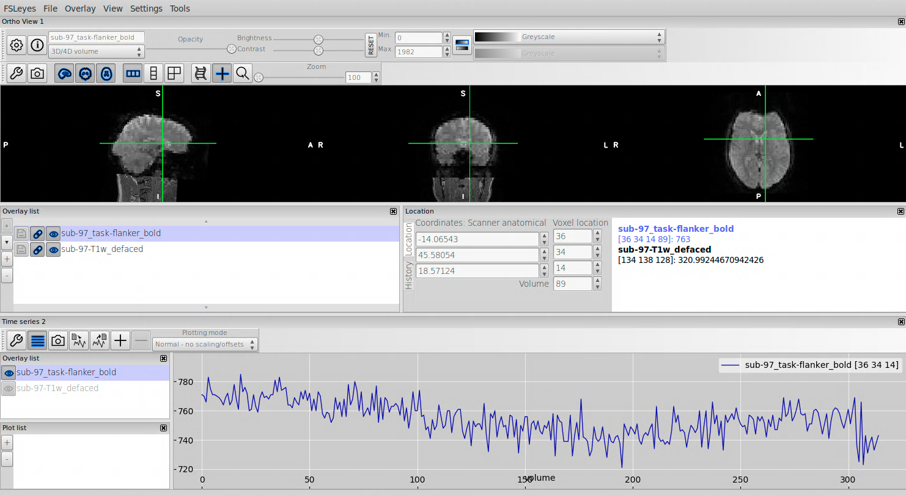

**By the end of this practical you should be able to:**  
* [ ] use the terminal to navigate to where your MRI data for this course will be  
* [ ] open MR images with fsleyes  
* [ ] distinguish between structural and functional images in contrast, resolution, and dimensions  
* [ ] use fsleyes to identify the coordinates and intensity at the cursor location, and toggle images on/off  
* [ ] view the timeseries of a functional image
 

**Access FastX** through the remote login:  
https://fastx.divms.uiowa.edu:3443/   
 

**First prep step**, make a folder for holding data for our labs:  
*  Open your terminal by clicking on the icon showing a little black screen
*  Type `pwd`. Where are you in the computer filesystem?
*  Type `ls`. What other files are here?
*  To make a new folder using the terminal type `mkdir fmriLab`
  *  Did it work? Type `ls`
  *  How did that work? Type `man mkdir`
*  Go into the new folder you made by typing `cd fmriLab`
 

**Second prep step**, download some images:  
*  Copy/paste `wget -O lab01_images.tar.gz https://osf.io/bprq5/download/`
*  Use commands introduced above to see what was downloaded
*  To unpack the download copy/paste `tar -xvf lab01_images.tar.gz`
*  Move yourself into the folder with data by typing `cd osfshare`
 

**Open fsleyes**:  
*  Open fsleyes by typing `fsleyes &`
  *  The `&` at the end tells the terminal to run this program in the background, meanwhile you still have access to the terminal to run other commands
 

**Open an image with fsleyes**:  
*  Click on `File` -> `Add from file`
*  Open the file named `sub-97-T1w_defaced.nii.gz`
  * "defaced" means the face has been removed from the image, why do you think we did that?
 

**Understanding the T1 image**:  
* Initial observations: try to answer these questions with your neighbours
  * What kinds of tissues are the brightest and darkest?
  * Place your cursor at different places in the image and see how it affects coordinates shown here:
  
  * In addition to the coordinate location of your cursor, what additional information is being shown here?
    
  * So, how many dimensions are there in the image?
* Brief review on anatomy
 

**Terms for talking about anatomy in an image**:  
*  Hover over these icons and click them on/off to see what they do  

*  What do the letters on the four sides of each view shown below mean?  

 

**Add a functional image on top of the structural**:  
*  Use steps learned from above to add a new image
*  Add the file named `sub-97_task-flanker_bold.nii.gz`
*  Place cursor in the brain somewhere and then toggle on/off the functional image using this button:

* Observations
  * What kinds of tissues are the brightest and darkest?
  * Does the functional image have more or less anatomical detail than the structural T1 image?
  * Use the menu at the top-left of your screen to view the BOLD timeseries for a voxel: View -> Time Series
    * Compare time series data inside and outside the brain
    * Change plotting mode to compare magnitude of signal change in different locations
  * So, how many dimensions are there in the functional image?
* Example with timeseries viewer on:
  
