**By the end of this practical you should be able to:**  
* [ ] use the FEAT GUI to create a group-level map of task-related BOLD activation  
* [ ] locate and understand results using the html reports and fsleyes  
 

**Access FastX** through the remote login:  
https://fastx.divms.uiowa.edu:3443/   
 

**Prerequisite**: Before you start group analysis, you should have `flanker.feat` output folders that you created in the derivatives folder for sub-001 and sub-002. I have provided the output for sub-097, who also performed this same task. Your directory tree should look like this:  
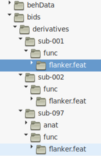
 

**Group analysis GUI**: Our group analysis will determine the average activation across subjects for each of our contrasts that we made within-subjects (e.g., con>baseline, neu>baseline, inc>baseline, inc>nue, inc>con).
*  In terminal, move yourself to the derivatives folder by typing `cd ~/fmriLab/data/bids/derivatives/`
*  Type `fsl` and click on `FEAT FMRI analysis`
*  In the top-left menu, select `Higher-level analysis`:  
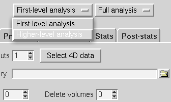
 

**Set input and output on `Data` tab**: 
*  Keep default of `Inputs are lower-level FEAT directories`
*  Keep `Number of inputs` to 3, because we have 3 subjects 
*  Click to `Select FEAT directories` and select each of your `flanker.feat` folders:  
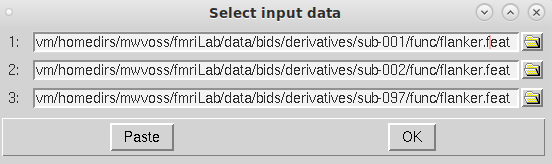

*  Keep `Use lower-level copes` as default, these are the five contrasts we set for the single-subject analyses
*  Specify output directory to be in derivatives with the name `group_n3`:  
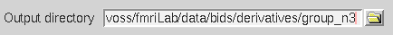
 

**Setup group model on `Stats` tab**:  
*  Select `Fixed effects`, which computes an average generalizable to only this set of participants. This is most appropriate if you have less than 10 subjects.
*  Select `Model setup wizard` and keep the default of `single-group average` and click `Process`:  
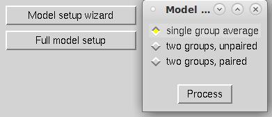 
 

**Our group model**: Now what does the red line represent? 
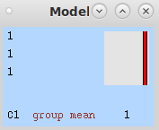
 

**Post-stats tab**: all settings here can stay as default.
 

**Click `Go`**: 
*  An html output report will come up in your browser. 
*  Once done, navigate to `Results` and click on `Lower-level contrast 3 (inc)`
*  You should see the map below:  
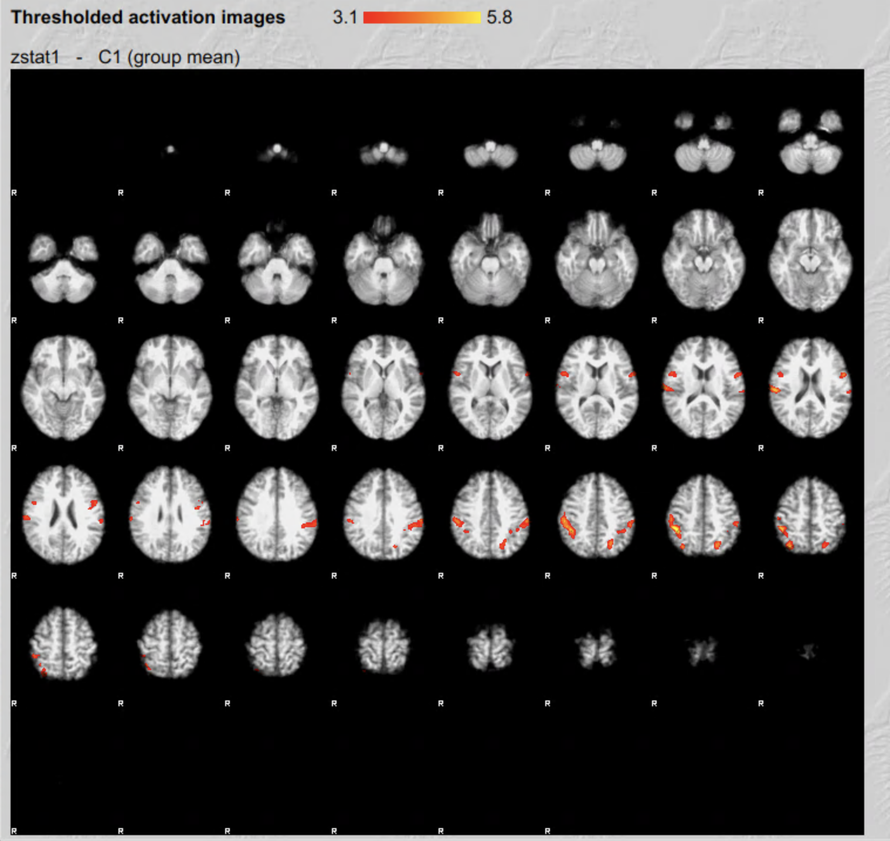
 

*  Click on the image in the html report, let's talk about the table you see below:  
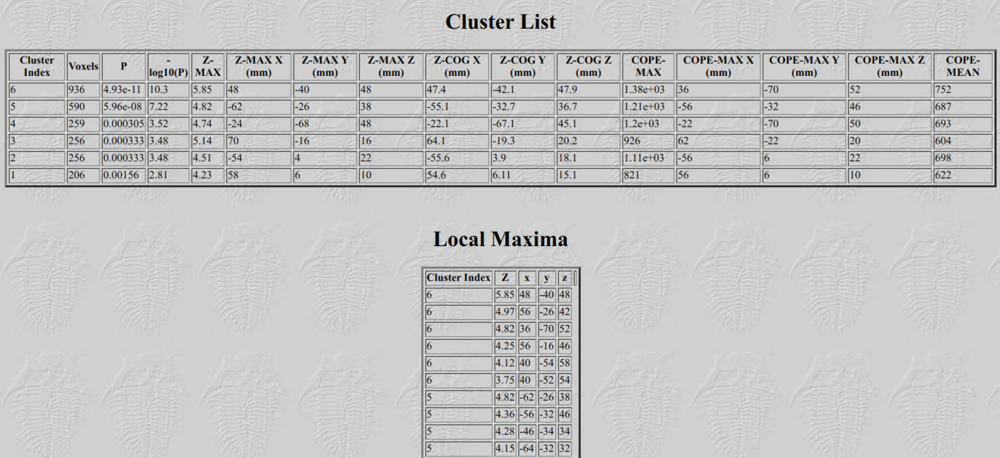

* Just like with single-subject analyses, we can also use `fsleyes` to view the results more interactively:
    * Use the html report to locate the directory where the activation maps are on your computer
    * Use the terminal to move yourself there: `cd ~/fmriLab/data/bids/derivatives/group_n3.gfeat/cope3.feat/`
    * Open `fsleyes` through the terminal with settings for viewing FEAT output: `fsleyes -ad /opt/fsl/data/standard/MNI152_T1_2mm_brain.nii.gz rendered_thresh_zstat1.nii.gz`
    * You should see a display like below in `fsleyes`. Clicking on the buttons with arrows in the column labeled `Z Max location` will move your cursor to the location of that peak in brain activation. 
 
 

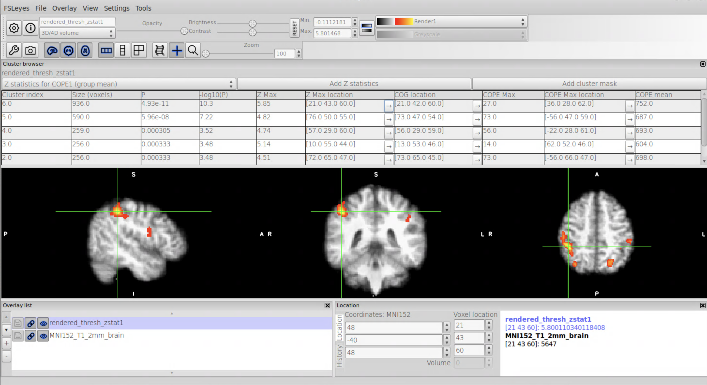

 

At the end of a task-activation group analysis our statistical maps are in a standard template space, which is a coordinate system and anatomical space that is common for all subjects so that we can compare activations across the subjects, to results from other studies using the same common reference space, and to anatomical atlases built in that same reference space.
    * FSL comes with a [collection of atlases](https://fsl.fmrib.ox.ac.uk/fsl/fslwiki/Atlases) in the MNI152 standard template space that we can view in `fsleyes` to look up anatomy of activation peaks.
    * In the `fsleyes` menu, select `Settings -> Ortho View 1 -> Atlas panel` as shown below. You will now see a new panel in your `fsleyes` layout that links you to the atlases bundled with FSL. 
 
 
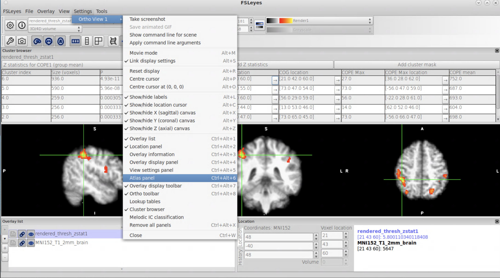
 
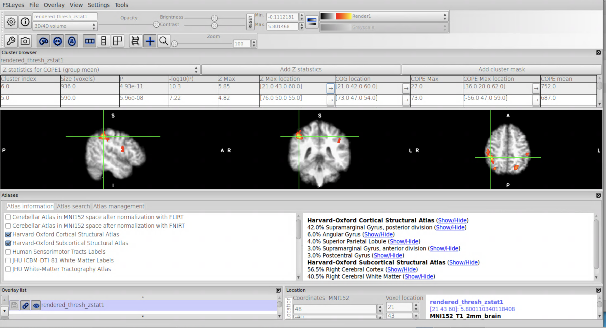

