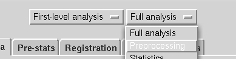
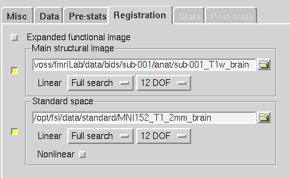
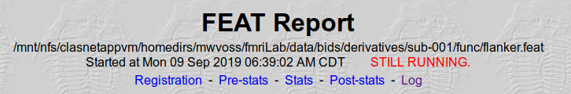

**By the end of this practical you should be able to:**  
* [ ] open FSL's FEAT GUI  
* [ ] use the FEAT GUI to preprocess our functional MRI data  
* [ ] locate and check FSL's preprocessing report  
 

**Access FastX** through the remote login:  
https://fastx.divms.uiowa.edu:3443/   
 

**Prepare a folder to hold output for each subject:**  
*  move to the bids directory in the terminal by typing `cd ~/fmriLab/data/bids`
*  check that you're in the right place, type `ls` and you should see folders named `derivatives`,`sub-001`, and `sub-002`
   *  `derivatives` is a folder for output of functional analyses
   *  protects the raw data from being over-written
*  make new derivatives folders for sub-001 and sub-002
   *  type `mkdir -p derivatives/sub-001/func`
   *  type `mkdir -p derivatives/sub-002/func`
 

**Open the FEAT GUI:** 
*  in terminal, type `fsl` and click on `FEAT FMRI analysis`

**Define scope of `First-level analysis` to `Preprocessing` at the top of the GUI:**
 

 
 

**Data tab in FEAT GUI:** 
*  on the `Data` tab, click `Select 4D data` and select sub-001's fMRI flanker data:
  

*  then choose output directory: click on the folder icon, navigate to sub-001's func folder under derivatives, click `OK`, then specify the location by typing `flanker.feat` in the `Data` tab like so:  

 

**Pre-stats tab in FEAT GUI:** 
*  Keep MCFLIRT on with the default reference volume
*  Keep slice-timing as `None` here
*  Keep BET brain extraction on for the functional data (yellow box means 'on')
*  Set spatial smoothing to 6 mm
*  Keep the highpass filter on
 

**Registration tab in FEAT GUI:** 
*  Select `Main structural image` to open that window
*  Setup yours as shown below, with your `T1w_brain` image as the main structural image, and change search options to `Full search` and `12 DOF`  

**When you've set registration, click `Go`**  

An html file should pop up in your browser, showing a log of the analyses progress. As it's running let's locate and talk through the output.  

 
 

**Once you've successfully run preprocessing for sub-001, repeat these steps for sub-002 before next class.**  
