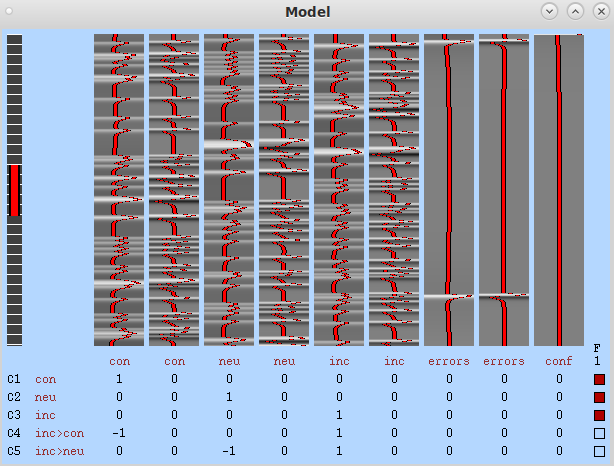

**By the end of this practical you should be able to:**  
* [ ] create and understand a model of task-related BOLD signal in the FEAT GUI  
* [ ] understand how to test for activation differences between conditions  
* [ ] locate and view the activation maps in fsleyes  
 

**Access FastX** through the remote login:  
https://fastx.divms.uiowa.edu:3443/   
 

**Create model of task-related BOLD signal in FEAT:**  
*  In terminal, move yourself to the derivatives folder by typing `cd ~/fmriLab/data/bids/derivatives/`
*  Type `fsl` and click on `FEAT FMRI analysis`
*  Now instead of `Preprocessing` select `Statistics` in the drop-down menu at the top, like so: 

*  Then select `Input is a FEAT directory` and navigate to `sub-001`'s `flanker.feat` directory: 

*  Move to the `Stats` tab, first turn on `Add additional confound EVs` and then select the text file that is shown below:  

*  Next, click on `Full model setup`. We will walk through set up of this as a class, including a closer look at the structure of the input text files. However, for reference, tabs for each explanatory variable (EV) should look like what is shown below:  

EV1:  
  

EV2:  
  

EV3:  
  

EV4:  
  

*  After setting up the EVs, stay in the `Full model setup` window and go to the `Contrasts & F-tests` tab. Set up the contrasts as below, and we will discuss what this means. Click `Done` when setup complete.  

* After completing the `Full model setup` you will get your model! Let's walk through it to understand the figure.  

* The last tab in the FEAT GUI is `Post-stats`. We will leave the defaults on for now. The settings here are most relevant when we get to group-level analyses.

* Click `Go`. When it's finished, the results will appear within your `flanker.feat` directory. Your html report will then include output of brain activation maps as previewed below. We will walk through the contents of the report in class.  

* Using `fsleyes` will allow us to view the results more interactively:
    * Use the html report to locate the directory where the activation maps are on your computer
    * Use the terminal to move yourself there: `cd ~/fmriLab/data/bids/derivatives/sub-001/func/flanker.feat`
    * Open fsleyes through the terminal with settings for viewing FEAT output: `fsleyes -ad filtered_func_data.nii.gz stats/zstat1 stats/zstat2`
    * You should see a display like below in `fsleyes`. Clicking on the buttons with arrows in the column labeled `Z Max location` will move your cursor to the location of that peak in brain activation. With this interactive table open, you can also view your activation maps using the `Lightbox` view we previewed when learning about `fsleyes`. Give it a try!
 

 
* Once you've completed all the steps above for `sub-001`, repeat for `sub-002`. Before next class, you should have statistical maps for the same contrasts, in the **same** order, for both subjects.

